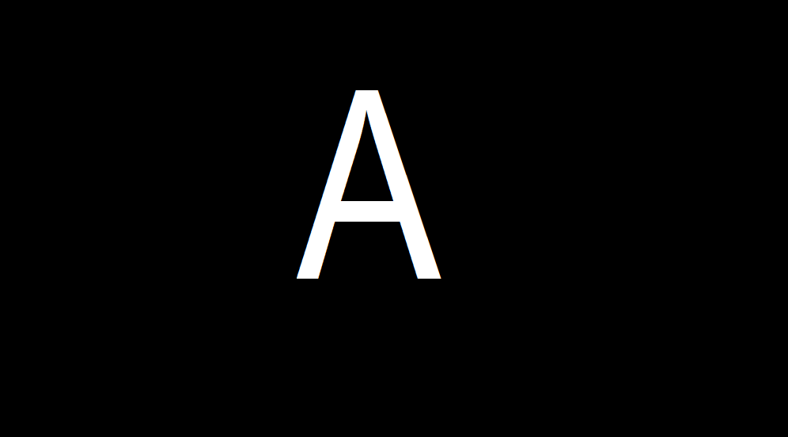
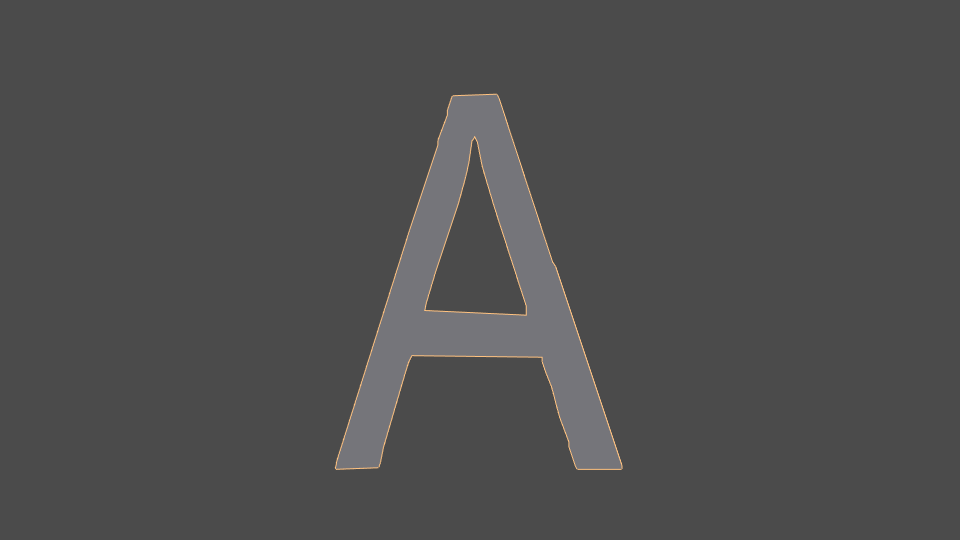
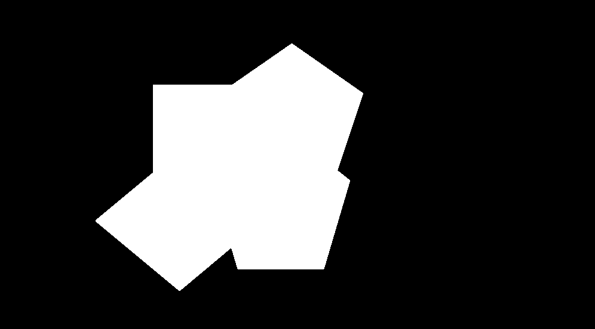
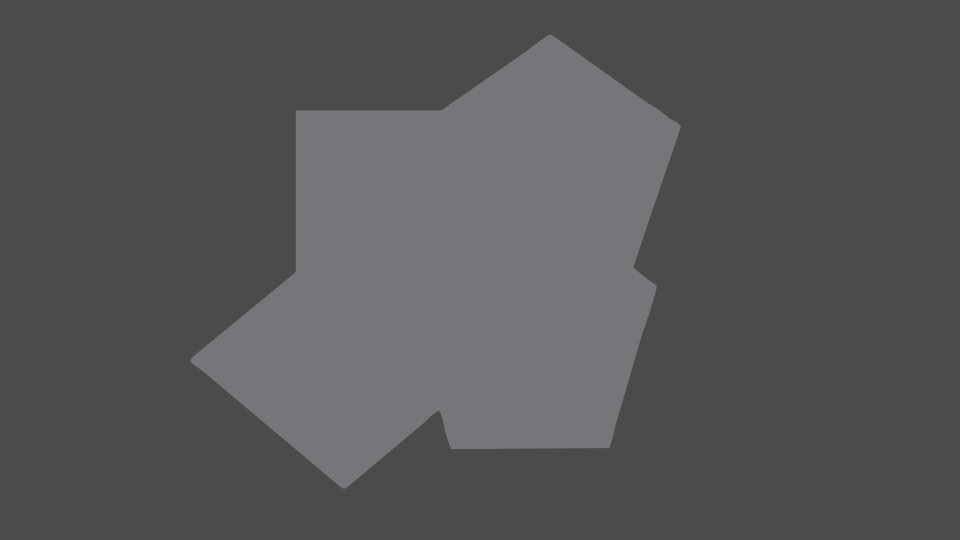
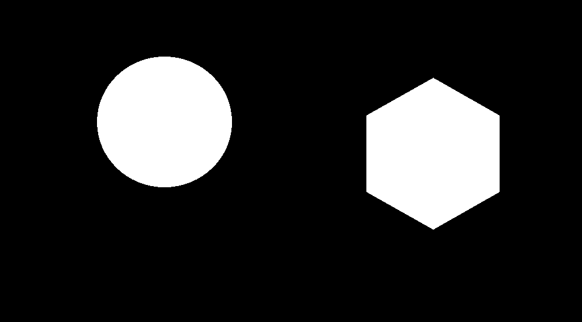
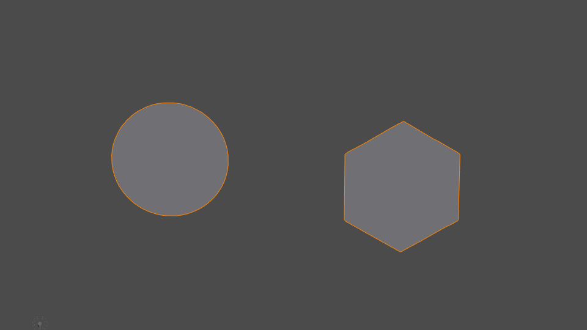
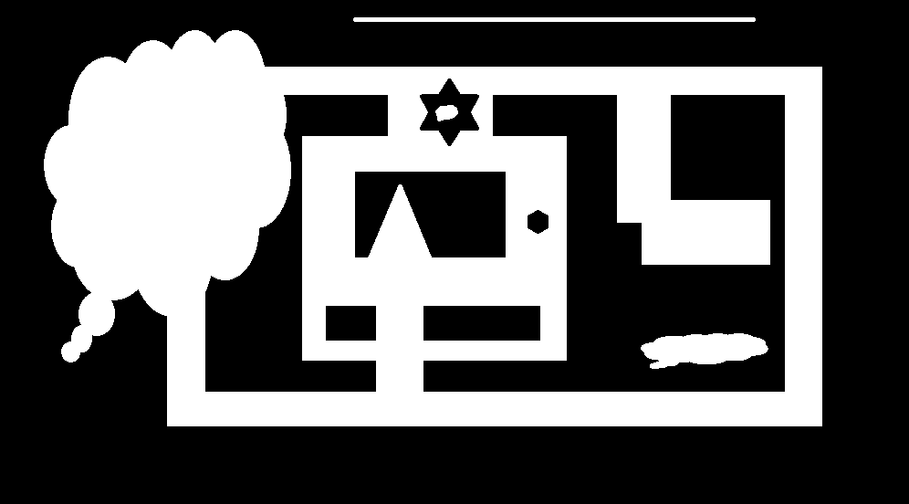
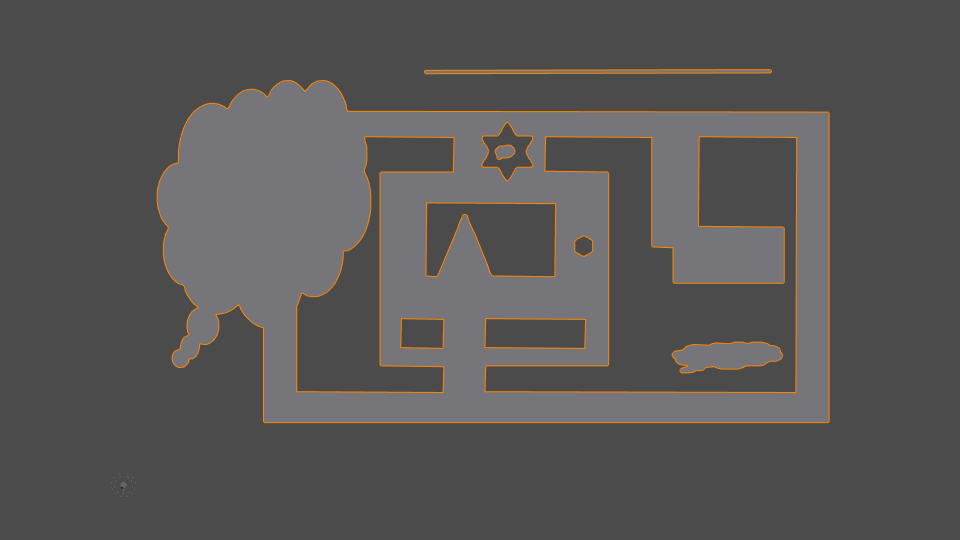
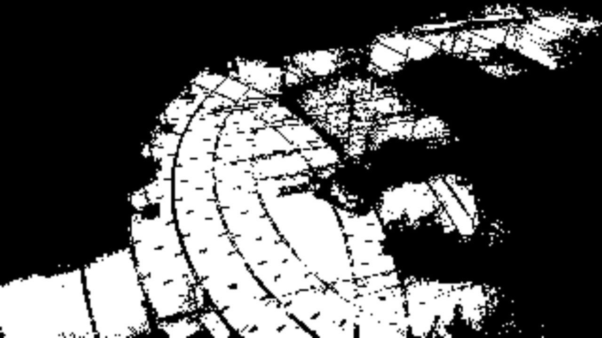
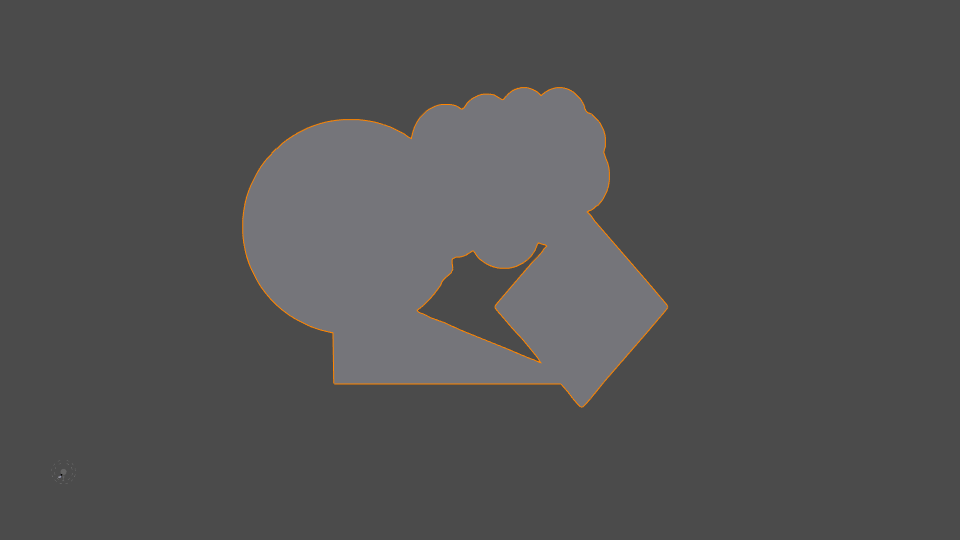

# ContourToMesh
## Generates a mesh from a binary image using OpenCV contours and Triangle library.

Requires: (On Python 3.6)
* Triangle
* Shapely
* Openmesh

| OpenCV Input  | Blender Result (.obj) |
| ------------- | --------------------- |
|||
|||
|||
|||
|||

> Note that the last image has been dilated/eroded in order to make the mesh more connected.
